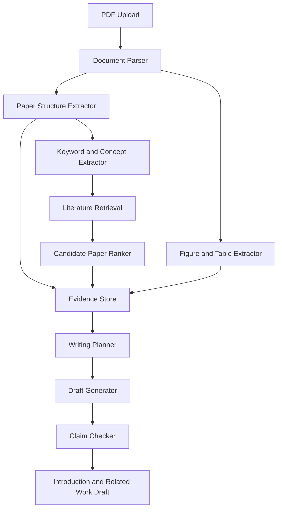

# Bioinformatics Paper Writing Agent MVP Design

## Goal

Build a personal bioinformatics paper writing agent that can read uploaded scientific PDFs, retrieve reliable related literature, and help draft English Introduction and Related Work sections with explicit evidence tracking.

The MVP optimizes for correctness, traceability, and human review over full automation. It must not fabricate literature metadata, citation relationships, experimental results, or biological conclusions.

## Product Scope

### In Scope

- Upload one or more bioinformatics paper PDFs.
- Parse single-column and two-column scholarly PDFs.
- Identify title, abstract, major sections, references, figures, tables, captions, and in-text figure or table mentions.
- Extract study problem, contributions, method, datasets, experimental settings, metrics, major results, and limitations.
- Retrieve references, citing papers, same-task papers, and recent related papers from reliable scholarly sources.
- Summarize candidate papers with relevance reasons and suggested writing positions.
- Analyze writing style from uploaded examples.
- Generate Introduction and Related Work outlines before draft text.
- Generate English draft paragraphs with paragraph purpose, source annotations, and `[需要用户补充]` markers.
- Mark uncertain paper metadata, figure interpretations, and biological claims as `needs_human_check`.

### Out of Scope for MVP

- Full manuscript generation beyond Introduction and Related Work.
- Automatic submission-ready citation formatting for every journal style.
- Fully autonomous Google Scholar crawling.
- Guaranteed extraction of every complex table from scanned or low-quality PDFs.
- Automatic biological validation of experimental conclusions.
- Multi-user collaboration, billing, permissions, or cloud account management.

## Architecture

The MVP uses a local-first web application with an asynchronous document-processing pipeline.



### Runtime Components

- Frontend: simple web console for upload, processing status, evidence review, literature table, outline, and draft.
- Backend API: FastAPI service with endpoints for upload, paper inspection, retrieval, and draft generation.
- Worker: background pipeline for PDF parsing, extraction, retrieval, indexing, and writing jobs.
- Storage: SQLite for metadata and JSON records in MVP; vector index through LanceDB or Chroma for paragraph retrieval.
- External services: PubMed, Semantic Scholar, OpenAlex, Crossref, Europe PMC, arXiv, and bioRxiv where relevant.
- LLM layer: configurable model provider for structured extraction, style analysis, figure/table explanation, outline generation, and draft generation.

## Module Design

### 1. PDF Ingestion

Responsibilities:

- Accept PDF uploads.
- Compute a file hash to avoid duplicate ingestion.
- Store original PDFs in `data/papers/originals`.
- Create paper records with processing status.
- Record parser errors with actionable messages.

Primary data:

```json
{
  "paper_id": "paper_001",
  "filename": "example.pdf",
  "sha256": "hash",
  "status": "uploaded|parsed|indexed|failed",
  "created_at": "2026-06-17T00:00:00Z"
}
```

### 2. Document Parser

Responsibilities:

- Run GROBID as the primary scholarly parser when available.
- Use PyMuPDF and pdfplumber to recover page-level text blocks, images, page numbers, and tables.
- Normalize parser output into a single internal paper representation.
- Preserve page numbers and character offsets wherever possible.

Parsing strategy:

- Use GROBID TEI for title, abstract, authors, sections, references, and DOI candidates.
- Use page-layout extraction for figure/table positions and missing captions.
- Use a section classifier for non-standard headings such as `Materials and Methods`, `Implementation`, `Benchmarking`, or `Availability`.

### 3. Bioinformatics Content Extractor

Responsibilities:

- Extract research question, task, biological context, method type, datasets, metrics, result claims, and limitations.
- Recognize domain terms such as RNA-seq, single-cell, spatial transcriptomics, multi-omics, pathway analysis, gene regulatory networks, variant calling, AUROC, F1-score, P-value, and FDR.
- Attach every extracted fact to a source span.

Output example:

```json
{
  "type": "metric",
  "value": "AUROC",
  "source": {
    "paper_id": "paper_001",
    "section": "Results",
    "page": 7,
    "text": "Performance was evaluated using AUROC..."
  },
  "confidence": "high"
}
```

### 4. Figure and Table Understanding

Responsibilities:

- Detect figure and table captions.
- Extract figure/table images or table grids when possible.
- Link in-text mentions such as `Figure 1`, `Fig. 2`, and `Table 3` to their visual objects.
- Summarize figures and tables with explicit uncertainty.

MVP behavior:

- Textual captions are trusted more than visual interpretation.
- Tables extracted into structured rows are marked `confirmed`.
- Screenshots or vision-generated summaries are marked `needs_human_check` unless the information is directly visible and simple.
- Complex heatmaps, UMAP/t-SNE plots, ROC curves, and network diagrams receive cautious summaries.

### 5. Literature Retrieval

Responsibilities:

- Identify the uploaded paper using DOI, title, authors, and year.
- Retrieve reference metadata.
- Retrieve citing papers when available.
- Retrieve same-task and recent related papers using extracted keywords, method names, datasets, and study objects.
- Deduplicate candidate papers across sources.
- Mark unverified metadata as `needs_human_check`.

Preferred sources:

- PubMed and NCBI E-utilities for biomedical metadata.
- Semantic Scholar Graph API for references, citations, abstracts, and influential citation metadata.
- OpenAlex for broad scholarly metadata and citation graph coverage.
- Crossref for DOI and publisher metadata.
- Europe PMC for biomedical full-text and citation metadata where available.
- arXiv and bioRxiv for preprints.

Google Scholar is not a primary automated source in MVP because it lacks a stable official public API. It may be shown as a manual confirmation target.

Candidate paper record:

```json
{
  "title": "Example related paper",
  "authors": ["A. Smith", "B. Lee"],
  "year": 2024,
  "venue": "Bioinformatics",
  "doi": "10.0000/example",
  "url": "https://doi.org/10.0000/example",
  "relation": "references_uploaded|cites_uploaded|same_task|recent_related",
  "relevance_reason": "Uses the same benchmark dataset for single-cell cell type annotation.",
  "usable_for": "Related Work: benchmark comparison",
  "verification_status": "confirmed|needs_human_check",
  "sources": ["Semantic Scholar", "Crossref"]
}
```

### 6. Evidence Store

Responsibilities:

- Store extracted facts, source spans, figure/table links, candidate literature, and writing claims.
- Provide retrieval by paper, section, topic, method, dataset, metric, and claim.
- Prevent draft generation from treating unsupported text as confirmed evidence.

Evidence object:

```json
{
  "evidence_id": "ev_001",
  "kind": "text|figure|table|literature_metadata",
  "claim": "The uploaded paper evaluates performance using AUROC.",
  "source_label": "Uploaded Paper A, Results, p. 7",
  "source_payload": {
    "paper_id": "paper_001",
    "section": "Results",
    "page": 7
  },
  "confidence": "high|medium|low",
  "needs_human_check": false
}
```

### 7. Writing Style Analyzer

Responsibilities:

- Analyze uploaded papers for Introduction and Related Work structure.
- Extract reusable writing patterns without copying long passages.
- Capture domain-specific rhetorical moves: biological motivation, computational gap, benchmark limitation, dataset importance, and methodological contribution.

Style profile:

```json
{
  "introduction_pattern": [
    "Begin with biological or clinical relevance.",
    "Introduce data modality and analysis challenge.",
    "Describe limitations of existing computational methods.",
    "State method motivation and contributions."
  ],
  "related_work_pattern": [
    "Group prior work by task and model family.",
    "Separate database resources from prediction algorithms.",
    "Use benchmark limitations to motivate the current method."
  ],
  "phrasing_patterns": [
    "However, existing methods often...",
    "To address this limitation, we..."
  ]
}
```

### 8. Writing Generator and Claim Checker

Responsibilities:

- Generate an outline before drafting.
- Generate paragraph plans with purpose, evidence, and missing user inputs.
- Draft English Introduction and Related Work text.
- Attach source annotations to important claims.
- Check drafts for unsupported claims, fabricated metadata, exaggerated contribution language, and causality errors.

Paragraph plan:

```json
{
  "section": "Introduction",
  "paragraph_index": 2,
  "purpose": "Problem and limitation",
  "evidence": [
    "Uploaded Paper A, Introduction",
    "Related Paper B, Abstract"
  ],
  "missing_inputs": [
    "Specific limitation of the user's proposed method"
  ]
}
```

Draft rule:

- Supported factual statements must include source annotations.
- Unsupported claims must be softened or replaced with `[需要用户补充]`.
- Unconfirmed literature metadata must not appear as a definitive citation.

## Data Flow

1. User uploads PDFs.
2. The ingestion module stores files and creates paper records.
3. The parser produces normalized section, paragraph, reference, figure, and table records.
4. The extractor creates domain-specific evidence records.
5. The retrieval module identifies the uploaded papers and fetches reference, citation, and related literature metadata.
6. The ranker scores candidate literature using relation type, metadata confidence, keyword overlap, embedding similarity, venue relevance, and recency.
7. The evidence store indexes text spans, captions, extracted claims, and literature records.
8. The style analyzer builds a writing style profile from uploaded papers.
9. The writing planner creates Introduction and Related Work outlines.
10. The draft generator writes paragraphs with purpose labels and source annotations.
11. The claim checker flags unsupported or uncertain text before the draft is shown as usable.

## Accuracy Principles

- Do not fabricate experimental results.
- Do not fabricate references, DOI values, authors, venues, or citation relationships.
- Do not overstate method novelty or contribution.
- Do not convert correlation, association, or benchmark performance into biological causality.
- Do not confuse databases, tools, algorithms, benchmarks, and datasets.
- Mark uncertain figure interpretations, statistical metrics, biological conclusions, and metadata as `needs_human_check`.
- Prefer saying `需要人工确认` over producing a confident but unsupported statement.

## MVP User Workflow

1. Upload one to five PDF papers.
2. Review parsed paper cards with title, abstract, sections, figures, tables, references, and extraction confidence.
3. Start retrieval for references, citations, related work, and recent papers.
4. Review candidate literature table and mark irrelevant or uncertain papers.
5. Generate writing style profile.
6. Generate Introduction and Related Work outlines.
7. Review paragraph purposes and source plan.
8. Generate English draft.
9. Review claim checker warnings.
10. Add missing method details, experiment results, and novelty statements where `[需要用户补充]` appears.

## Recommended Tech Stack

- Backend: Python 3.11+, FastAPI, Pydantic, SQLAlchemy.
- Worker: FastAPI background tasks for MVP; Celery or RQ when jobs become long-running.
- Storage: SQLite for MVP metadata; PostgreSQL when multi-project or multi-user use is needed.
- Vector search: LanceDB or Chroma.
- PDF parsing: GROBID, PyMuPDF, pdfplumber, Camelot or Tabula.
- Retrieval APIs: PubMed/NCBI E-utilities, Semantic Scholar Graph API, OpenAlex, Crossref, Europe PMC, arXiv, bioRxiv.
- LLM: provider-agnostic text model for extraction and drafting; vision-capable model for figure/table explanation.
- Export: Markdown first; DOCX and BibTeX after MVP core workflow is stable.

## First-Phase Milestones

### Milestone 1: PDF Parsing

- Upload PDFs.
- Extract title, abstract, sections, references, figures, tables, captions, and page numbers.
- Persist normalized paper JSON.

### Milestone 2: Bioinformatics Extraction

- Extract study problem, task, method, datasets, metrics, results, and limitations.
- Attach every extracted item to source evidence.
- Provide confidence and uncertainty flags.

### Milestone 3: Literature Retrieval

- Match uploaded paper identity.
- Retrieve references, citing papers, same-task papers, and recent related papers.
- Deduplicate and rank candidate literature.
- Mark unconfirmed metadata for human review.

### Milestone 4: Evidence Index

- Build searchable text and evidence index.
- Support topic-level retrieval for writing.
- Link text claims to source spans, figure/table captions, and literature records.

### Milestone 5: Writing Assistance

- Generate style profile.
- Generate Introduction and Related Work outlines.
- Generate paragraph plans and English draft text.
- Run claim checking before final display.

## Acceptance Criteria

- The app can ingest at least three bioinformatics PDF papers and identify the major sections.
- The app can extract at least title, abstract, references, section text, figure/table captions, datasets, metrics, and major method descriptions for typical digital PDFs.
- The app can retrieve candidate references, citations, and related papers from at least three reliable scholarly sources.
- Every candidate paper displays title, authors, year, venue/source, DOI or URL, relation, relevance reason, usable writing position, and verification status.
- Generated Introduction and Related Work drafts include an outline first.
- Each generated paragraph includes a writing purpose.
- Important factual claims include source annotations.
- Unsupported method details, experiment results, or novelty claims are marked `[需要用户补充]`.
- Uncertain metadata and figure/table interpretations are marked `需要人工确认`.

